# 1 软件安装

## 1.1 简介及系统要求

CODESYS是德国3S公司开发的PLC软件，集成了PLC逻辑、运动控制、组态显示等功能。与西门子、倍福不同的是，3S公司只做软件，而硬件由OEM厂商如汇川、施耐德等实现，也可以由通用设备比如树莓派、BBB、x86工控机实现。

对于开发者来说，软件主要分为两个部分。一部分是开发环境（IDE），用于编写代码、编译、调试，开发过程中的大部分操作都在IDE上。另一部分是运行时（RTE），运行时安装在设备上，一般由OEM厂家安装并配置好。

旧版的CODESYS软件现在很少见，版本号是2.3.9，界面类似TwinCAT2。本文档主要面向版本号在3.5.9以上的新版codesys软件。开发环境推荐CPU不低于4核2Ghz，4G内存，128G固态硬盘，WIN10及以上操作系统。

TIP: **常见的文件后缀**
项目文件：**\*.project**  
项目打包：**\*.projectarchive**（包含项目、库、图片等可选的打包文件，双击解压）  
包文件：**\*.package**（包含库、设备描述文件等，双击安装）  
库文件：**\*.library**（纯库实现，通过库管理器安装）  
设备描述文件：**\*.xml** 、 **\*.gsdxml** 、 **\*.eds**（纯设备实现，通过设备管理器安装）  

## 1.2 与其它plc软件的差异性

- 西门子`TIA V15+`：芯片级的硬件PLC，必须使用西门子硬件，非周期任务，总线一般支持Profinet、Modbus、EIP、Canopen。IDE需要授权，RTE不需要授权。稳定性最佳，性能一般，不需UPS。  
  
- 倍福`TC3 4022+`：软件PLC，运行时可以跑在wince、wes7、win10等系统上，周期性任务，专有实时驱动，内核起源于codesys但有大刀阔斧的修改，开发环境基于Visual Studio。授权细分较多，每个总线和功能分别收费。插TF卡的机器稳定性略差，价格较高，性能较好，对EtherCAT支持好。WES7及以上系统需配UPS。

- CODESYS`3.5.9+`：软件PLC，运行时一般跑在Linux和Windows上，周期性任务，专有实时驱动，开发环境独立且可定制。授权分为定制授权和通用授权，部分功能单独收费。此外还可以购买开发包，可以定制IDE。汇川的inoproshop、施耐德的somachine等都是基于codesys二次开发的。非定制系统需配UPS。

在CODESYS框架内，性能差异如下（估值，实际根据硬件配置差异较大）：

| 名称 | PLC性能 | 本地VISU性能 | SOFTMOTION性能 | 价格（RMB） |
| ---- | ---- | ---- | ---- | ---- |
| arm Linux | 1ms赋值2万条 | 不支持 | 8轴插补4ms | 2k~4k |
| 树莓派 | 1ms赋值3万条 | 300ms响应 | 4轴插补4ms | 2k~5k |
| x86 Linux | 1ms赋值30万条 | 50ms响应 | 8轴插补1ms | 4k~8k |
| x86 Windows | 1ms赋值35万条 | 50ms响应 | 32轴插补1ms | 9k~15k |

## 1.3 面向过程的编程思路

面向过程（POP）与面向对象（OOP）是两种基本编程思路，在这里我们不去具体介绍两种编程方法的差异，而是简单讨论一下编程思路。虽然很多资料、培训会介绍面向对象适用于复杂项目，但笔者认为，面向对象适用于界面架构、系统架构等上层应用，适用于多人或多框架参与的项目，每个对象有相似的接口和调用方法。而PLC逻辑无论简单还是复杂一定是面向过程的，按流程执行，流程内的每一条语句都有它的规范用途，应当尽量减少无用的指令和减少程序块。

虽然CODESYS支持OOP，但在实际应用中，OOP会造成代码结构庞大、不易调试及检查。此外，方法、属性、动作的不规范使用也是实际应用问题的多发点。使用OOP方式编程的代码也不易转到其它系统上。

如果您对OOP感兴趣，确保不要为了面向对象而面向对象地编程。OOP只是一种编程思路，如果面向过程的思路遇到了困难，那么面向对象一样会有困难。大多数面向过程解决不了的问题可以通过CASE分步、封装Function Block和指针、内存的操作解决，如果这还解决不了，请考虑将算法、顶层控制等内容通过C++、C#、Python、JS等语言编写并通过Shared Memory、TCP等通讯方式与PLC交互。

## 1.4 开发环境安装及设置
CODESYS历经多个版本，不同版本安装过程会有细微的差异，请根据您安装时的提示灵活多变。本文展示3.5.17.30的开发环境安装。

WARNING: **关闭杀毒软件**
安装前建议关闭Windows Defender及其它杀毒软件，由于安装过程会创造很多小文件，对这些小文件的病毒扫描会极大地延长安装时间。如果您之前安装过其它版本的CODESYS，建议手动删除`C:\ProgramData\CODESYS`文件夹，这将删除所有旧版的库、设备和配置，但可以创建相对干净的安装环境。

安装包名称为 **CODESYS 64 3.5.17.30.exe** ，大小约1.9G。双击开始安装。首次安装会自动检测缺失的运行库，单击Install进行安装（运行库部分）。

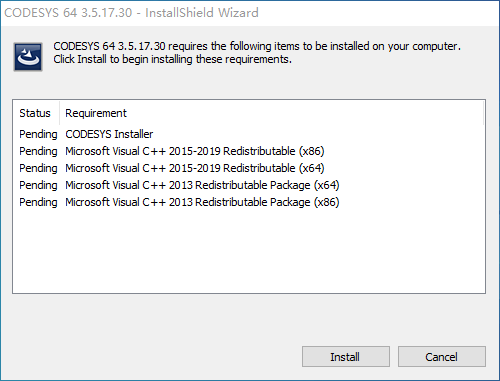 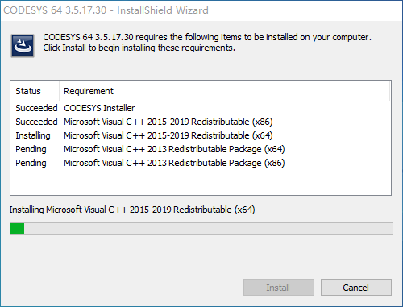

安装完运行库后，安装程序会消失几秒钟（仍在后台处理，不要重复运行安装程序），之后进入正式安装程序。安装过程一路下一步即可。

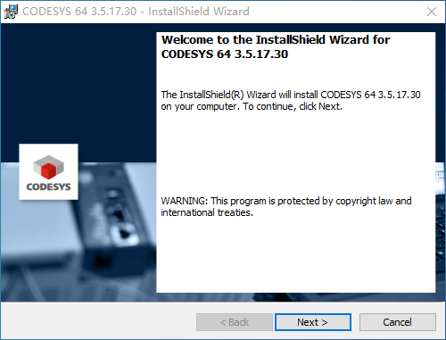 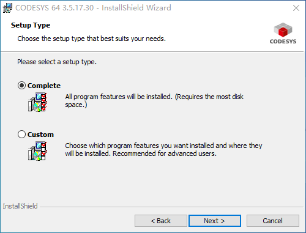

3.5.16之后的版本安装需要10~30分钟，显示Install all Packages时请耐心等待，此处没有进度条。

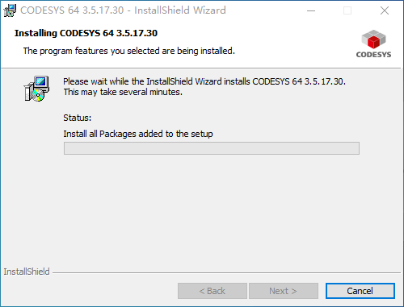 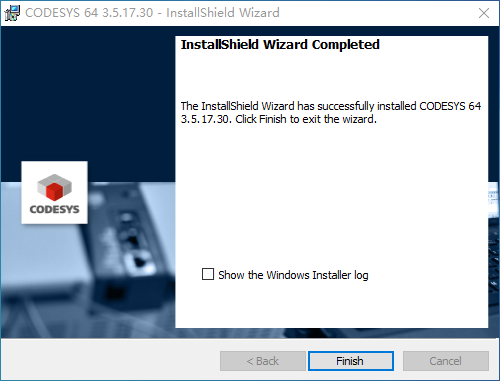

安装完软件后，请确保您系统右下角托盘中有以下三个图标：

1.  CODESYS Control Win SysTray（用于仿真）
2.  CODESYS Gateway SysTray（用于扫描设备及连接）
3.  CodeMeter（用于授权管理）

WARNING: **防火墙**
如果您将本地连接设为不信任网络（公用网络），则还需要在防火墙中打开CODESYS的公用网络权限或关闭防火墙。

TIP: **语言设置**
在使用IDE的过程中，建议您将IDE语言设置为英文（工具-选项，语言设置，用户界面语言）。目前的中文翻译表达欠佳，且编辑visu时更易导致软件崩溃。CODESYS IDE稳定性相对于TIA软件较差，在编写代码时请注意随时保存。

## 1.5 运行时安装及设置

NOTE: **官方在线化**
CODESYS从3.5.17开始，包管理器变为在线化的CODESYS Installer，有了更正式的包签名流程。但缺库的问题没有得到缓解，包的离线安装变得更困难了，目录也更乱了。  

>? NOTE: **完全离线安装package-单击展开详情**
CODESYS Installer（APInstaller）是个彻头彻尾的半成品软件，我想不明白工业基础软件为什么会强制使用在线服务？1.4以上版本甚至还要求Edge Webview2 Runtime但无法离线安装，我十分怀疑3S公司有没有测试工程师？  
这里简单说一下特定旧版本树莓派4.6.0.0的包如何完全离线装在3.5.17.30的IDE上。虽然是完全离线安装，您还是需要一个可以联网、装有codesys的电脑以提取包文件，该包文件没有公共下载链接，只能通过提取的方式。具体步骤如下：  
1、确保可联网机器为全新安装，或手动删除CODESYS Edge Gateway for Linux、CODESYS Control SL Extension Package两个包后操作。  
2、打开可联网机器的CODESYS Installer，单击Change，单击Browse，搜索**raspberry**，版本选4.6.0.0，安装。***下载完成后就可以进到下一步，即使安装结束也不要点OK***。  
3、找到`C:\Users\[您的用户名]\AppData\Local\Temp\APInstaller`，其中一个文件夹下有以下三个package文件，先拷出来。  
  
4、接下来是匪夷所思的一步，用7Z打开CODESYS Control for Raspberry PI 4.6.0.0.package，把package.manifest拷出来，编辑66、77行的FromVersion改为4.8.0.0，或者把RefrerenceOptional改为True。改完了再用7Z压回包里替换掉原始文件。  
5、将三个包文件拷到离线电脑上，依次安装即可。

### Linux（Raspberry Pi）

Linux（或Raspberry Pi）通过SSH安装，您需要先安装对应的包，如 **CODESYS Control for Raspberry PI 4.6.0.0.package** 。建议在网络环境下，用CODESYS Installer-Browse搜索raspberry，选择版本号进行安装。
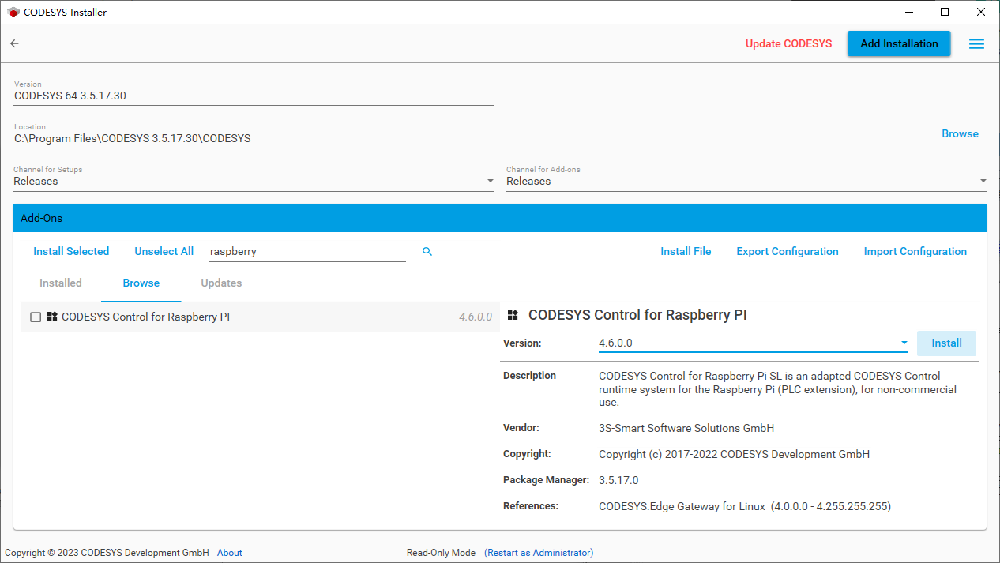 

安装完成后，工具菜单下会多出Update Raspberry pi选项。输入用户名和密码，输入目标IP地址，选择版本，单击Install即可安装。

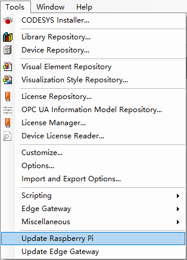 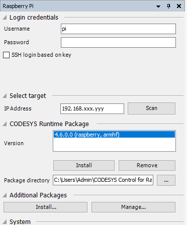 

### Windows（Control RTE）

本小节特指x64（win10系统）下安装的RTE。一般情况下，建议使用Intel Core i3/i5/i7系列的标压CPU，4G以上内存，64G以上固态硬盘。请确保网卡在实时驱动的兼容列表中。RTE与IDE独立，在一台电脑上可以只安装RTE，也可以安装IDE和RTE。运行 **CODESYS Control RTE 64 3.5.17.30.exe** 开始安装。

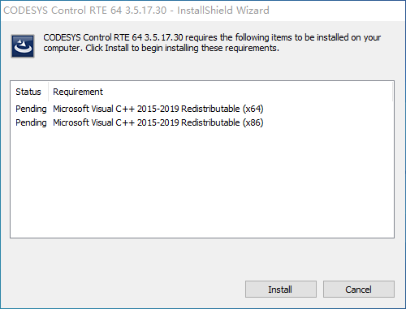 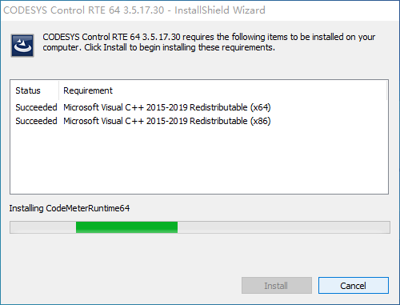 

安装完基础运行库后，进入安装程序。Windows下的Control RTE是隔离核心的方式，会自动检测有多少个CPU核心并分配其中一个给RTE使用。  
（2核CPU装完RTE后只有一个核心给Windows，4核CPU装完后还剩3个核心给Windows，所以一般推荐4核。但采用超线程技术的CPU将会禁用超线程，即双核4线程CPU装完后还是只有一个核心给Windows。）

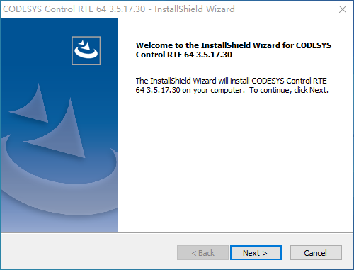 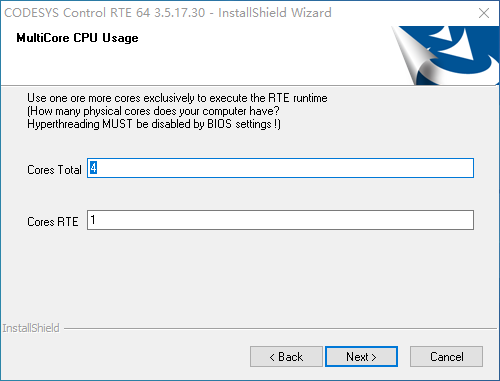 

WARNING: **版本选择和防火墙**
选择Target Type of RTE时一定要注意，一般来说都是选CODESYS SoftMotion RTE。此外，建议选择打开防火墙权限，否则可能扫描不到设备。

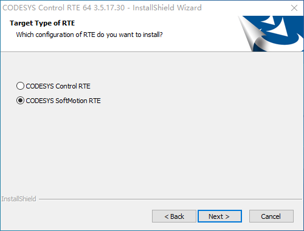 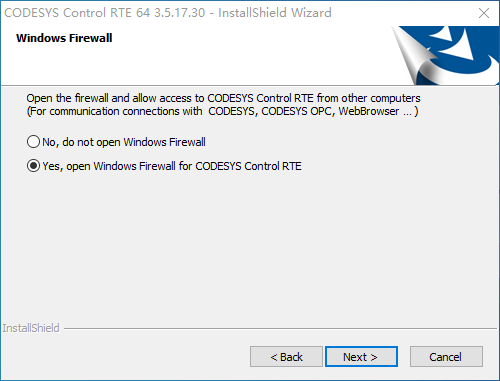 

这里两个都点OK/YES即可。

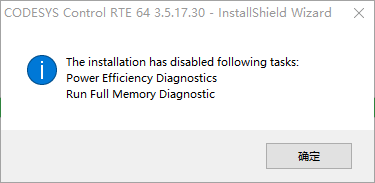 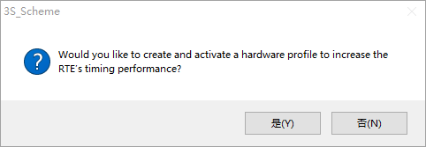 

安装完成并重启后，需要在设备管理器里手动安装实时网卡驱动。选择一次驱动并安装后，驱动可能不会更新，需要在已安装驱动列表内再次选择。若还不成功，需手动删除`C:\Windows\INF\net1ic64.inf`文件并再次安装驱动即可。安装完驱动后建议重启一次。做好配置文件的设置后，在系统托盘区手动启动一遍RTE，确认无问题后勾选Startup中的两个选项，开机后即会自动启动。

TIP: **运行时的配置文件所在位置** 
Linux SL：`/etc/CODESYSControl_User.cfg`  
ControlRTE：`C:\ProgramData\CODESYS\CODESYSControlRTEV3\CODESYSControl_User.cfg`  
ControlWin：`C:\ProgramData\CODESYS\CODESYSControlWinV3x64\[一串字母]\CODESYSControl.cfg`  

NOTE: **建议取消用户管理（默认强制的登录密码保护）**
编辑配置文件，找到**[CmpUserMgr]** 下的`;SECURITY.UserMgmtEnforce=NO`，删除最前面的`;`符号并保存。

## 1.6 许可激活和转移

所有受支持的电脑和设备都可以安装CODESYS RTE，主要包括x86 Windows、x86 Linux和arm Linux。当前的政策是无授权状态下可以运行总线、softmotion、visu等功能30分钟，RTE本身和PLC逻辑2小时，超出时间后会停止对应的功能或退出RTE。激活授权后可以无限制地使用对应授权的功能。

部分授权是针对OEM厂商的，只有特定厂商的设备才可以被激活，厂商标识通过SysTargetOEM驱动指定或包含在RTE本体中。一般而言，单条授权码包含多项功能（如RTE SM WV）即为OEM定制版授权。您可以在 [store.codesys.cn](http://store.codesys.cn){target=_blank}或[store.codesys.com](https://store.codesys.com){target=_blank} 上查看有哪些授权，各包含什么功能。有些厂商如汇川、施耐德、禾川等不需要授权，它们集成在定制版RTE或驱动中。

Codesys授权依赖**CodeMeter**服务，CodeMeter是wibu的一套加密软件，可通过软容器或硬件加密狗实现加密。运行时授权可以激活在加密狗上，也可以激活在软容器上。授权激活时IDE所在电脑需要连接网络以访问在线许可服务，激活后可以完全离线。但激活后授权就无法转移，与加密狗或软容器绑定。

您可以在 [license.codesys.com](https://license.codesys.com){target=_blank} 上查询许可和激活情况，一般而言，显示 **Available** 是未激活，显示 **Activated** 是激活在加密狗中，显示 **Not completed** 是激活在软容器中。软容器的编号主要根据CPU序列号生成，所以重装系统不会变更软容器编号，并可以将旧的授权导入。但CPU损坏则授权也失效。

TIP: **许可的激活步骤** <iframe width="100%" height="800" src="../images/be10c3c1baf440b99995d280da40418b.pdf"></iframe>

授权激活后，会在PLC根目录生成`CMLicenseNew.WibuCmRaU`文件，后续可通过该文件还原授权。需要注意的是，RTE版本不同有可能导致该文件无法使用，运行正常并且激活后不建议升级/降级RTE版本。

**许可的离线转移：**

WARNING:  通常情况下，离线转移并不意味着可以从一台电脑转移到另一台电脑。除非得到官方的同意并在后台操作，否则，它只能发生在重装系统后的授权恢复或是RTE有版本更新，无法通过旧授权文件恢复授权时操作，尤其是在内外网隔离，IDE电脑无法联网的情况下，且许可的激活状态必须为Not completed。

若需要转移，先在IDE上授权管理器中申请转移并生成转移请求文件，标准的codesys授权使用的Software vendor Firm Code是5000304。再在license.codesys.com上提起转移申请，上传请求文件并下载更新的授权文件即可。

## 1.7 实时补丁和实时驱动

一般来说，PLC代码的运行需要一个稳定的循环周期以明确代码执行时间及进行通讯。为了保证PLC的周期循环可以顺利执行，需要实时性。在Linux中，实时性靠Preempt-RT实时补丁保证。在Windows中，分为Control Win和Control RTE两种。安装IDE时会自带Control Win，一般用于仿真，不具有实时性。而Control RTE从专用安装包安装，隔离掉一个物理核心，具有实时性。

对于EtherCAT：

- Linux通过RAW Sockets，不需要特殊驱动，实时性相对差一些。
- Control Win由winpcap软件收发包，不具有实时性。
- Control RTE由专用网络驱动进行收发包，具有实时性。

除了以上三种RTE外，还有特殊的系统比如STM32裸机、FPGA等有特殊方法实现，具体实现方式需要咨询官方。

需要注意的是，在Linux中，即使内核打了实时补丁也不保证实时性，还是需要优化CPU占用。而在Control RTE中，由于使用了隔离核心的技术，Windows系统的占用对PLC逻辑没有影响。故在中大型、多轴或复杂控制中宜选用Control RTE。

