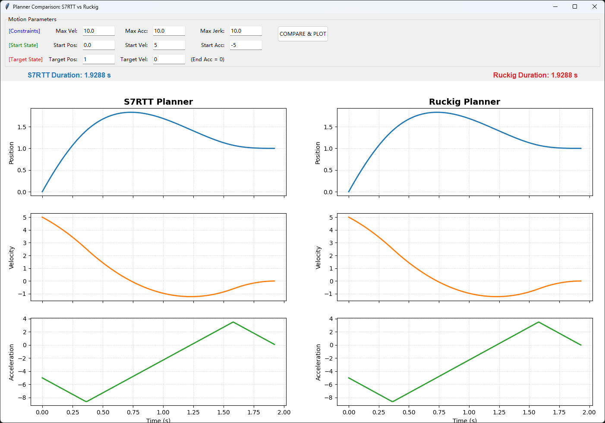

# 12 附录：S7RTT

## 12.1 简介

在规划一个点到点的运动控制时，我们通常需要预先规划好Jerk限制的S型速度曲线，可以有效避免速度拐点处（加速度突变）所带来的机械结构震动。PLCOpen只定义了上使能、运动等规范，但没有具体定义S型速度曲线尤其是边界条件下的规划问题，这部分一般由各厂商自己编写且不公开。

目前开源的最优解应当是Ruckig，我们在之前的文章中有简单介绍过。但它存在一些缺陷，例如当单位是mm且速度或加加速度较大时，经常会规划失败，这是不可接受的。为此，我进行了一些研究，编写了 [S7RTT](https://github.com/feecat/S7RTT) 库，针对单轴运动提供C++、C、Python和ST的完整规划代码。


## 12.2 Why & How

要理解S型曲线，首先必须对比最常见的梯形速度曲线。梯形曲线的加速度是恒定的（突然启动，匀加速，突然匀速，突然匀减速）。这意味着在变速的瞬间，加速度从0瞬间跳变到Amax。加速度的突变意味着作用力的突变，梯形曲线在拐点处的加加速度（Jerk）理论上是无穷大的。

S型曲线的速度波形像一个平滑的“S”形，它的加速度是逐渐变化的（加速度曲线呈梯形）。通过限制 Jerk 的大小，保证了作用力的平滑过渡。

除了标准的S型速度曲线外，还有以下几种：

- 基于Sin²的速度曲线，不需要设定Jerk，相当于经过处理后的梯形速度曲线。缺点是打断运动时可能带来抖动，常用于固定轨迹的重型设备。
- 基于S型速度曲线并经过滤波（Quadratic+smooth），常用于液体传输，更加平滑但同样无法打断运动。
- 基于贝塞尔曲线，著名的G2采用的就是这种方式，它实现了6阶加加速度控制，我们将稍后对其深入介绍。
- 基于样条线和B样条线，常用于多轴插补时的上位轨迹规划。

## 12.3 如何实现及难点

正如ruckig所提到的，我们需要的是一个**时间最优**的解决方案，由于可能在运动过程中的任何一个时刻打断运动，我们需要规划从任意初始状态（初始位置、速度、加速度均不为0）到任意结束状态的时间最优策略。但这将导致复杂度直线上升，在《Trajectory Planning for Automatic Machines and Robots》 的3.5小节我们可以看到，规划一个限定范围内的S型速度曲线需要解三次甚至四次方程，在实际应用中还需要处理距离不足或超过限制的情况。

一个典型的边界情况是，最大速度、加速度、加加速度均为`10`，从起始位置`0`、起始速度`5`、起始加速度`-5`移动到结束位置`1`、结束速度`0`。在简化逻辑中，我们会先将加速度往0方向运动，归零后再进行规划，但这将导致非最优解。最优解应当是让加速度继续向负方向降低以尽快刹车，达到一个特定值后再升高，越过零点后再处理过冲。这个计算过程必须在刚开始时就确定好，否则会先刹停后再逆向运动处理过冲，这样速度会3次过零，仍然造成了非最优解。这些边界条件的处理就是S7RTT和Ruckig所实现的核心。

 

虽然Ruckig公开了论文和源代码让我们能窥见轨迹规划的核心，但我仍觉得太复杂了，很好奇CODESYS和TwinCAT是如何做的。通过一些逆向工程，我发现了一些未匿名的函数：
```
CMC7PFuncAndObj::PhaseDown
CMC7PFuncAndObj::PhaseUpOffAccRange
CMC7PFuncAndObj::PhaseDownOffAccRange
CMC7PFuncAndObj::PhasesOne
CMC7PFuncAndObj::PhasesLHL
CMC7PFuncAndObj::PhasesHML
CMC7PFuncAndObj::PhasesLMH
CMC7PFuncAndObj::PhasesHLH
CMC7PFuncAndObj::PhasesHMLoffAccRange
CMC7PFuncAndObj::PhasesLHLoffAccRange
CMC7PFuncAndObj::GenerateRTT
CMC7PFuncAndObj::ReduceVeloRequired
CMC7PFuncAndObj::StateAndTimePropagator
CMC7PFuncAndObj::StatePropagator
CMC7PFuncAndObj::MaxEntranceVelocity
```

这些函数显示它将`MaxEntranceVelocity`作为计算的核心依据，再据此规划具体的Phases。虽然没有源代码，但通过它的结构和逆向代码可以猜测大概的功能，此外在`RootsCubEquation`发现了卡尔丹/韦达法求解三次方程的特征，并使用牛顿法精修卡尔丹结果。在`RootsBiquadEquation`发现了法拉利法求解四次方程的过程。

然而，逆向完整的代码是非常困难的，且触及到厂家知识产权，因此需要重新规划我的程序。好在有Gemini 3 Pro的帮助，大大简化了我的思考过程。

## 12.4 实现过程

Gemini 3 Pro认为三次、四次方程的求解过于复杂了，它采用了一种比较取巧的策略，即创建一个预测函数，再使用Brent法对这个预测函数进行求解。Brent是一种非精确的迭代法，它会造成一定的性能浪费，但在C++的压力测试中我们和Ruckig性能基本相当。

具体的实现过程可以参考源代码，也可以让AI帮你分析。总的来说主要是以下几个步骤：

1. 若当前状态超过了极限，则先规划减速段。
2. 尝试时间最优规划，首先估算搜索范围，再定义求解逻辑，最后使用Brent法迭代求解，并使用双向竞争选择最优解。
3. 若时间最优解规划失败或不需要时间最优，则进入退化求解，先将加速度归零再规划，这可能不是时间最优，但确保有解。
4. 若存在匀速段，则进行精度补偿。

在大量数据的压力测试中，我们可以做到绝大多数情况下都比Ruckig结果更优。以下是测试结果：

a) 最大速度、加速度、加加速度分别是1000、10000、100000（1米/秒，1G加速度），同时Ruckig缩放1000倍（单位米）。位移范围±500随机，初始速度、结束速度和初始加速度在最大值内随机。
```
################################################################################
FINAL STATISTICS
################################################################################
Total Tests: 100000
----------------------------------------
CATEGORY             | S7RTT      | RUCKIG    
----------------------------------------
Plan Failures        | 0          | 0         
Sim Acc Failures     | 0          | 0         
----------------------------------------
Faster Count         | 2606       | 1         
Draws                | 97393      | 97393     
################################################################################
解析：通过10万次随机测试，S7RTT的轨迹时间有2606次更优，Ruckig的轨迹时间有1次更优。
```

b) 与a相同，但Ruckig缩放1（单位毫米）
```
################################################################################
FINAL STATISTICS
################################################################################
Total Tests: 100000
----------------------------------------
CATEGORY             | S7RTT      | RUCKIG    
----------------------------------------
Plan Failures        | 0          | 182       
Sim Acc Failures     | 0          | 0         
----------------------------------------
Faster Count         | 2643       | 2         
Draws                | 97173      | 97173     
################################################################################
解析：当Ruckig单位不正确时，容易出现规划失败的情况。
```

c) Ruckig缩放改回1000（单位米），最大速度、加速度、加加速度分别在10~10000、10~100000和10~1000000范围内随机。
```
################################################################################
FINAL STATISTICS
################################################################################
Total Tests: 100000
----------------------------------------
CATEGORY             | S7RTT      | RUCKIG    
----------------------------------------
Plan Failures        | 0          | 8         
Sim Acc Failures     | 1          | 39        
----------------------------------------
Faster Count         | 22         | 40        
Draws                | 99891      | 99891     
################################################################################
解析：当限制随机时，可能出现最大加加速度比最大加速度小、最大加速度比最大速度小的边界情况，一条轨迹可能需要几千甚至几万秒。
```

d) 与c相同，但Ruckig缩放为1（单位毫米）。
```
################################################################################
FINAL STATISTICS
################################################################################
Total Tests: 100000
----------------------------------------
CATEGORY             | S7RTT      | RUCKIG    
----------------------------------------
Plan Failures        | 0          | 4633      
Sim Acc Failures     | 1          | 0         
----------------------------------------
Faster Count         | 30         | 39        
Draws                | 95298      | 95298     
################################################################################
解析：在恶劣条件下时，Ruckig开始频繁规划失败。
```

此外，Ruckig实际并不适用于**在线轨迹规划**，或者扩大一些来说，所有算法都不适用于在线轨迹规划。这是由于在线规划要求每个周期都以当前的位置、速度、加速度作为初始状态进行规划，但这极易在边界条件时规划出反复跳跃的轨迹。这通常是由于计算精度导致的，初始条件下的计算精度并不适用于中间状态，因此中间可能会规划过冲回退或非时间最优解。因此，我们应当在目标参数变更时进行新的规划，如果没有变更则执行上一次的规划结果。

针对这种情况，S7RTT做了针对性的优化，在Offline-Online对比测试中，目标速度不为0时只有约万分之一的轨迹会出现离线计算和在线计算不一致的问题，作为对比ruckig大约是20%（目标速度为0）或90%（目标速度不为0）。但我们仍然建议一次plan、多次at_time的方式。

总的来说，S7RTT在单轴规划上应当比Ruckig更优，尤其是在目标速度为0的情况下可以做到100%最优解。但是，在多轴插补及目标速度、加速度不为0的规划中，ruckig仍然有优势。

## 12.5 更高阶的轨迹规划

基于贝塞尔曲线的 [G2项目维基](https://github.com/synthetos/g2/wiki/Jerk-Controlled-Motion-Explained) 向我们揭示了如何实现6阶加加速度控制的轨迹规划，通过查阅源代码，我制作了一个 [codesys的测试程序](https://github.com/feecat/OpenSML/issues/4#issuecomment-1146995447) 。算法本身将一段运动规划为head、body和tail段，并在head和tail段进行离散化计算。

但这有个明显的缺点，当速度可以达到Vmax时，如果移动距离是小数，head和tail段都将为整数，而body段为小数。这将导致body段需要以中断的方式运行，而PLC是周期运行的。为此我在tail段叠加了另一条贝塞尔曲线，这类似于S7RTT的精度补偿，但在这里我们补偿tail段，可以实现无抖动的轨迹规划。当然，它不能在加速或减速的过程中打断运动。

在大多数应用中，Jerk限制的S型速度曲线已足够使用，这是由于驱动器使用pid跟踪目标位置，即使计算的曲线是六阶或更高阶，大多数驱动器也无法准确执行。或者说，即使使用梯形速度曲线，只要驱动器的响应特性设置的足够"软"，机械结构也不会有震动。

## 12.6 结尾

S7RTT旨在为单轴运动控制任务提供简单、快速且可靠的轨迹生成器。通过简化问题空间（将目标加速度固定为零），它实现了极高的性能和代码简洁性。