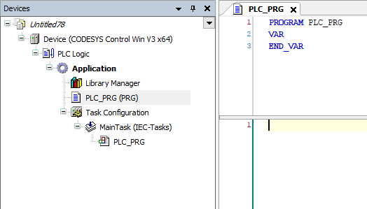
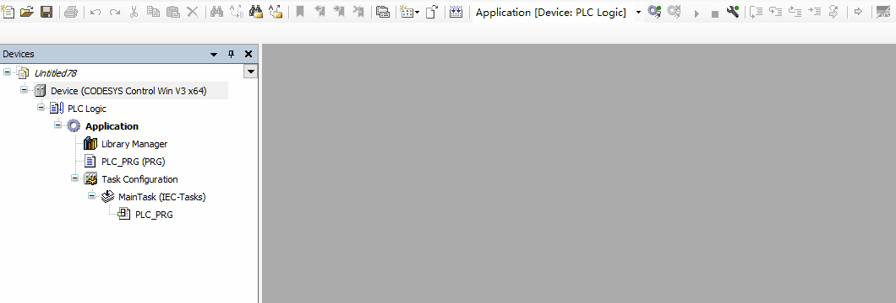
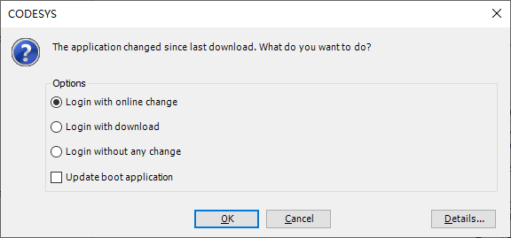
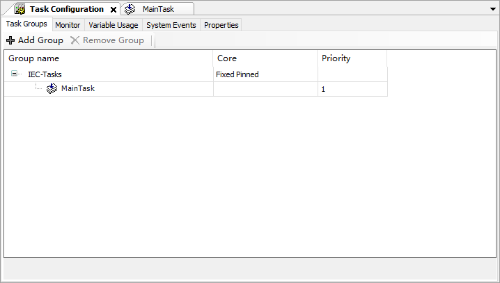
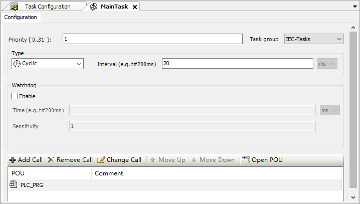
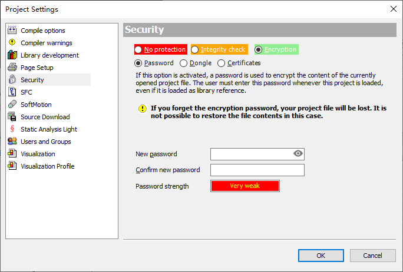
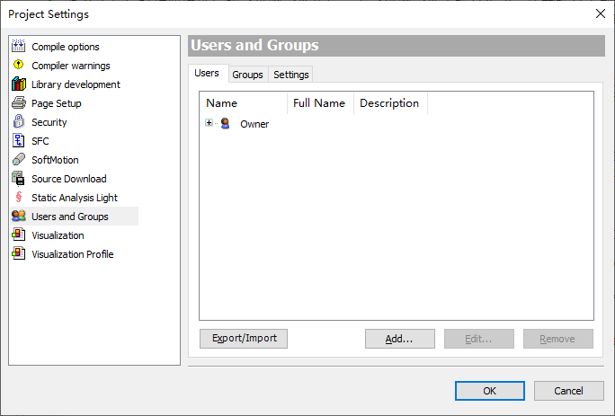
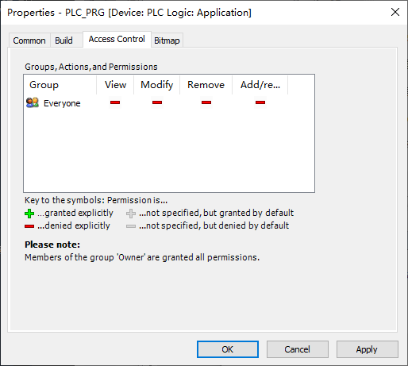

# 2 基础知识

## 2.1 代码的编译、下载与运行

不同的设备在创建项目时会有不同的附加组件，我们以软件安装时自带的ControlWin举例来展示操作流程。

您应该可以在右下角托盘区看到Control Win SysTray图标  ，单击后选Start PLC，等待三秒左右图标变红  ，即表示已启动。在没有授权的情况下，ControlWin会运行2小时，之后图标自动变灰。

打开codesys软件，新建标准项目（Standard project），设备选择 **CODESYS Control Win V3 x64** ，确认即可。

  

之后，您可以尝试搜索设备并下载程序。

当您对程序作出修改并登陆时，不牵涉设备变更内容的时候会提示在线修改，相当于TIA的 下载到设备->软件（仅更改）。在线修改不会停止PLC，且默认不更新启动应用。如果在线修改过程序且未更新启动应用，则PLC下次重启后仍会运行上一次的启动应用，这一点和TIA不同。故建议下载时勾选更新启动应用，或在关机前手动更新启动应用。

此外，某些时候多网卡的IDE环境可能搜索不到局域网内的设备，也可以在设备地址栏里直接输入回车以替代搜索功能。

## 2.2 设备树与程序树对象

对于程序的大多数操作都在Device选项卡内，可以理解为文件管理器，在里面创建POU程序、Visu、总线等对象。在一个项目中可以有多个Device，一个Device内可以有不同的Application。可以同时登录多个Device，但同一时刻在一个Device内只可以激活一个Application。大多数情况下，我们使用默认的单Device、单Application方案。

 <- 项目，可以创建第二个PLC（Add Device - Device），一般较少使用  
 <- 设备，可以创建第二个总线（Add Device - Fieldbuses），创建总线时使用  
 <- 逻辑，可以创建第二个应用（极少使用）  
 <- 应用，可以创建POU、Visu等（最多使用）  
 <- 库管理器，管理使用的库和版本  
 <- 程序内容，默认创建一个空程序  
 <- 任务管理器，分配任务组、循环周期  

中大型项目中还可以创建文件夹，归类以便查询。还可以将程序放在POU页中，不同Device可以调用同一套POU。

## 2.3 任务的执行过程

任务由运行时按照编译后的二进制文件执行，而二进制文件由项目生成。所有项目中都有任务配置（Task Configuration），在其中配置任务。多个任务可以分配到一个任务组中，当使用多核授权时，不同的任务组可以分配到不同的核心上执行。此外，处在在线状态时可以在任务配置-Monitor中观察到当前任务的实际运行时间和实时性抖动。

通常情况下，CODESYS使用周期任务（Cyclic），任务周期一般从500us到20ms。当设置为20ms时，任务中的程序每20ms执行一次。一个程序可以被重复调用，即在一个任务周期内多次执行。此外，还有自由任务（Freewheeling）可用于算法和文件处理，自由任务不需要设定周期，类似西门子默认的任务模式，但并非是执行完成后立即执行下个周期（最小周期）。一般来说自由任务的周期在1~20ms。

 

程序块（POU）可以被任务（IEC-Tasks）调用，依附在任务上，任务组按照优先级和循环周期执行，任务组内的不同程序块按照自上而下的顺序执行。在程序中也可以对其它程序调用，和任务处理方式没有区别。具体到代码中，程序也是自上而下执行的，整个程序执行两遍的间隔即为任务周期。一般来说，单个周期实际执行时间需要1~1000微秒，剩下的时间都是在等待下一个周期。

## 2.4 包、库、设备管理器

后缀名为package的文件为包，其中会包括设备描述、库，有些package还会在菜单中增加一些选项。

后缀名为library或compiled-library的文件为库，有些库是编译后的库不含有源代码（如官方的所有库），有些库含有源代码（oscat库），有些库含有源代码但有加密（私有库，不推荐，加密有破解风险）。

设备管理器分为运行时设备和总线设备，它们都在设备管理器里管理。有些旧版本的codesys需要手动选择文件后缀过滤，否则可能误识别。

NOTE: **项目打包**
当您把项目分发给其他人时，可能会遇到缺库或缺设备的情况。可以打包为ProjectArchive文件（File - Project Archive - Save Archive..)，用相同版本或更高版本IDE打开后即可自动补全库。
	

## 2.5 占位符和版本管理

库管理器管理库的版本，一般情况下建议根据ide版本设置为最新。当您打开一个较旧或较新的项目时，会提示是否更新库和配置。根据实际情况选择更新到最新版或保持项目版本。若有缺失库的情况，可在库管理器中下载缺失的库。

如果有网络不好或下载不了库的情况，也可以通过占位符手动修改版本号，但大多数情况下推荐用Project-Project Environment来更新版本。

## 2.6 二进制文件与加密

PLC逻辑经过编译后的文件就是二进制文件，该文件只有运行时可以执行。文件格式为app。此外，同目录下还包含crc文件，每次运行时都会进行CRC校验。与TIA不同的是，CODESYS默认不会上传源代码，只会上传编译后的二进制文件。一般意义上认为二进制文件是无法破解的。而运行时的加密主要防范广域网的攻击而非内部拷贝，所以一般不建议使用运行时加密。

项目文件的加密分为两个等级，一个是项目文件的自身加密，每次打开项目文件时需要输入密码。在Project - Project Settings - Security中选Encryption - Password即可。大部分的项目加密只需要到这一步。

 

第二个是用户组加密，可以对不同的POU赋予不同的用户组权限，在多人参与维护的程序中非常好用。用户组加密需要先创建一个用户，加入Owner组，用默认的用户名Owner确认（密码为空）。之后删除Owner用户并保留Owner用户组，在需要加密的程序属性中的Access Control选项卡里按需要给Everyone拒绝即可。这种方法可以创建多个用户组并分配不同的权限，或者用来保护部分核心程序。

 

