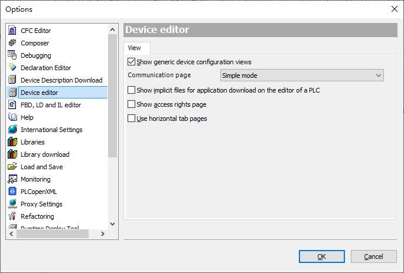
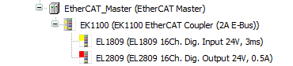
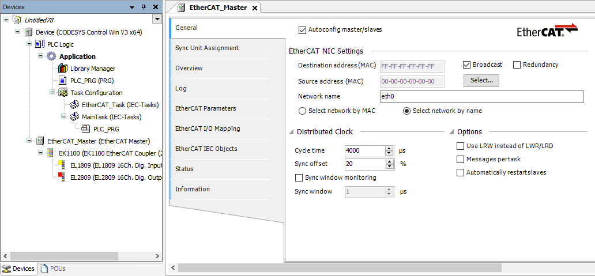
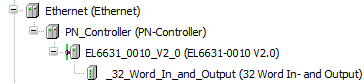

# 3 各类总线的专用设置

## 3.1 总线设备的添加与版本更新

在codesys中，Device下添加的设备为总线。您也可以在 [官方help](https://help.codesys.com/webapp/f_device_editors;product=codesys){target=_blank} 上查到关于各设备的具体信息。

设备中有一些隐藏的参数，如EtherCAT的DCSyncInWindow参数。  
在工具-选项，设备编辑器中勾选 **Show generic device configuration views** 以使能额外的设备配置选项卡：



TIP: **通讯自动优化**
默认情况下不使用的I/O地址不会更新变量实时值，可在I/O Mapping页右下角的Always update variables改为Enable 2即可。

## 3.2 EtherCAT的专用设置

NOTE: **系统设置**
- Linux SL/Raspberry pi：不需要特殊的设置。若有DC同步报警，可修改DCInSyncWindow参数，建议改大到500us。  
- ControlWin：需要安装 [WinPcap](https://www.winpcap.org/install/bin/WinPcap_4_1_3.exe){target=_blank} 软件才可以运行EtherCAT，且其不具有实时性，不可以运行SoftMotion。  
- ControlRTE：需要确保网卡已经安装了专用驱动，您应该可以在设备管理器的网络适配器中看到网卡为CoDeSys Gigabit Network。若开DC和不开DC时发包数量不一致，则需要考虑重装RTE。

EtherCAT总线设备分为两个，EtherCAT Master和EtherCAT Master SoftMotion，它们除了FrameAtTaskStart参数外完全一致，不带SoftMotion的为FALSE，每个PLC周期结束后才发EtherCAT帧。为TRUE时在每个周期开始时发EtherCAT帧，开启后发送和接收的数据会有延迟，可能会导致超采样出问题，但能提供优异的实时性。

EtherCAT总线依赖设备描述文件，您需要先在工具-设备管理器中安装设备，安装后的设备即可插入在EtherCAT Master下。EtherCAT还有设备树的规范，若您插入的设备是耦合器（如倍福EK1100），则EK1100下挂的模块都需要在EK1100设备上添加。之后的设备在EtherCAT Master下添加。

 

当您创建EtherCAT Master设备时，会自动创建EtherCAT_Task任务。该任务的周期由EtherCAT Master设备的Cycle Time参数指定，请勿手动修改。此外，需要选择EtherCAT网卡MAC地址或根据网卡名称自动选择（推荐后者），并建议勾选自动重启从站。

 

WARNING: **使用运动控制时的任务设置**
使用运动控制（SoftMotion）时，运动控制相关程序实例（如MC_Power、MC_MoveAbsolute等）所在的程序块必须安排到EtherCAT_Task下执行。

EtherCAT也支持扫描，添加EtherCAT Master并选择网卡后，登陆一次设备并下载PLC。无需启动，此时在EtherCAT Master设备上右键-扫描设备 即可进行扫描。添加完EtherCAT模块后，可在对应模块的I/O Mapping页中关联变量。

TIP: **设备关联与地址关联**
在使用TIA时我们通常使用地址关联，直接将变量关联到I、Q地址上。但在CODESYS中，我推荐在I/O Mapping中关联变量，这种方式不受设备地址影响，不容易出错。TC3需要定义AT %I\*/Q\*才可以映射，而CODESYS不需要这样做，可以关联任意变量。当然，大量的连续数组仍然推荐直接映射地址。

添加设备后，有部分设备会需要修改Startup Parameters，例如汇川GL20系列的模拟量模块通过设置transform mode改变电压/电流模式。有部分设备可选Process Data，如伺服驱动器配置默认在CSP模式，若要使用PP、PV模式则需要修改Process Data中的选项。可按实际情况修改。

## 3.3 Profinet的专用设置

根据经验来说，CODESYS的Profinet仅使用RT模式，通讯周期在2到32MS。IRT需要特殊硬件才可以实现。由于EPOS的功能块只在博图软件里闭源，所以PTP带轴的实现也极少。大多数情况下，CODESYS的PN需求都是旧设备改造、总线测试或协议转接。

作为PN主站时，操作和EtherCAT非常相似，添加PN主站、扫描或手动添加设备，登录即可。如需分配地址可在扫描时设定。PN使用普通以太网交换机就可实现星形连接，每个设备都有独立的、在一个网段下的IP。与EtherCAT不同的是，一般来说PN设备下插入的为报文Telegram（或叫模块Module），仍然是在这个设备上。

 

无论作为PN主站还是PN从站，都是在Ethernet设备下加PN主/从，而不是用CIFX卡。当PLC作为PN从站时，Windows系统中需要将防火墙打开，Linux系统中需要编辑配置文件，在最下面增加：
```
[SysEthernet]
QDISC_BYPASS=1
Linux.ProtocolFilter=3

[SysSocket]
Adapter.0.Name="eth0"
Adapter.0.EnableSetIpAndMask=1
Adapter.1.Name="eth1"
Adapter.1.EnableSetIpAndMask=1
```

当作为PN从站时，GSDXML设备描述文件可以从设备管理器的Fieldbuses - Profinet IO - Profinet IO Device下导出，注意有3.5.17和4.2.0两个版本可能混用，请确认实际使用的设备版本。此外，请确认CODESYS项目中的设备树和TIA项目中的设备树使用同样的Module（例如都用InOut_64_Byte）。

CAUTION: **不建议使用EnableSetIpAndMask**
PLC作为PN从站时，建议固定地址而不是使用 [EnableSetIpAndMask](https://help.codesys.com/webapp/_pnio_runtime_configuration_device;product=core_ProfinetIO_Configuration_Editor;version=4.1.0.0){target=_blank} ，即站点名称和IP都在CODESYS项目中指定。如果您需要可变的IP，请确保由上位PLC指定的IP不会与其它网口在同一网段下，并且 [避免用PN从站所使用的网口登录到PLC](https://help.codesys.com/webapp/_pnio_firewall_codesys_communication;product=core_ProfinetIO_Configuration_Editor;version=4.1.0.0){target=_blank} 。

## 3.4 Modbus RTU的专用设置

在Linux系统中，需编辑配置文件指定COM端口分配。例如：
```
[SysCom]
Linux.Devicefile.1=/dev/ttyAMA0
Linux.Devicefile.2=/dev/ttyUSB0
```

也可以直接归纳到ttyUSB中自动排序，例如：`Linux.Devicefile=/dev/ttyUSB`，这会自动把ttyUSB0映射到COM1，以此类推。

在Windows系统中，请在设备管理器中查看具体的COM端口。

Modbus没有设备描述文件，使用统一的Modbus Slave设备，根据对应的文档编辑Modbus Slave Channel来指定通讯内容和地址。通常使用的功能码为3和16，请注意通讯地址是10进制还是16进制。

 


## 3.5 Modbus TCP的专用设置

ModbusTCPSlave Parameters中有个参数Unit-ID，可以理解为RTU的从站ID。标准协议中已移除此校验，默认置为0xFF。但某些旧设备仍然保留该校验，可手动改为0x01或设备特定的ID。
	
除了标准的Modbus TCP slave设备外，还可以在其下添加Modbus Slave, COM Port，即TCP转RTU方案，可以用协议转换器或某些带RTU扩展的TCP模块。但部分带协议转换的转换器无需设置，相当于直接把TCP报文转为了RTU报文，这时Unit-ID是需要根据实际设备地址修改的。

## 3.6 Ethernet/IP的专用设置

EIP需要注意连接路径，有些设备连接路径不一定是设备描述文件中的。连接路径无法扫描，必须手动输入，不能有任何错误。

EIP也可以不使用设备描述文件，而是通过标准设备（Generic EtherNet/IP device）添加自定义连接路径来连接。大多数情况下，非标通讯只有OT和TO，只修改Instance ID和IO大小即可，其余选项不需要配置。

## 3.7 Canopen的专用设置

通常情况下，Linux上的Canopen会通过SocketCAN，使用CANable或MCP2515实现。而Windows上一般使用PCAN USB转换器实现。这两种都只支持标准CAN协议，最大波特率1M。

在Linux（Raspberry Pi）中，需要做如下修改：

编辑配置文件，在末尾增加如下行（4.5.0.0之后不再需要）：
```
[CmpSocketCanDrv]
ScriptPath=/opt/codesys/scripts/
ScriptName=rts_set_baud.sh
```
此外，can驱动加载可能晚于运行时导致无法通讯，可以关闭运行时自启动`sudo systemctl disable codesyscontrol`，之后延迟手动启动codesys服务。编辑/etc/rc.local，在exit 0之前插入：
```
sleep 5
sudo service codesyscontrol restart
```

而在windows中，若使用PCAN USB转换器，则需要编辑配置文件，在`[ComponentManager]`下添加一行**Component.X=CmpPCANBasicDrv**（将X更改为顺序的编号）

## 3.8 TCP UDP的专用设置

对于TCP、UDP的底层我们不再重复介绍，在PLC的实际应用中，我们一般把TCP作为可检测、可靠的UDP使用，即把TCP当作收发包而不是流模式使用。为了达成这一点，我们在一个PLC周期内对一个IP、端口只做一次读和/或写操作。如果在一个周期内多次写包，则在接收端可能被自动粘包。单个包的大小超过一定数量也会被拆包，需要在应用层做粘包操作。TCP的粘包操作是个伪概念，但在嵌入式和PLC设备中很好理解，部分设备会用 `$r$n` 换行符做数据包结尾，标准的Modbus TCP遇到粘包也会舍弃有效数据包后面的数据。

如果有大量数据传输的需求（大于MTU，一般是1500Byte），则在两个TCP帧的处理期间**有概率**会和PLC任务周期碰撞，导致**偶发性**的拆包。例如，一个2500Byte的数据，有时候收到完整的2500Byte，有时候被分割成两段1500+1000Byte由两个PLC周期处理。这种情况下需要在应用层做粘包操作。

TCP和UDP都是使用NBS库实现，在CODESYS中分为两个库，一个是官方库（Net Base Services），另一个是CAA库（CAA Net Base Services）。CAA的全称为CoDeSys Automation Alliance，现在已经很少提及，但代码非常稳定。本文档的TCP和UDP以CAA库实现，官方库的实现方法会有细微的区别。

TCP、UDP的通讯实现都是纯代码的，这意味着不需要额外的授权，同样的代码可以在汇川、施耐德等基于CODESYS的PLC上通用。

CAUTION: **命名空间**
官方库和CAA库的命名空间（Namespace）都是NBS，所以不建议在一个项目中同时使用两个库。如果一定要使用，需要手动修改命名空间。

这里是一个基础的TCP服务器的实现代码：
```iecst
VAR
	ip:NBS.IP_ADDR:=(sAddr:='0.0.0.0');//作为服务器时不需要设置IP，用0.0.0.0即可
	port:UINT:=55555;//服务器端口
	Server:NBS.TCP_Server;
	Connection:NBS.TCP_Connection;
	Write:NBS.TCP_Write;
	Read:NBS.TCP_Read;
	ton_LostConnect:TON;
	sReadData:STRING;
	xWriteEnable: BOOL;
	sWriteData:STRING;
END_VAR


//Server
	Server(xEnable:=NOT ton_LostConnect.Q , ipAddr:=ip ,uiPort:=port );
//Connect
	Connection(xEnable:=Server.xBusy AND NOT ton_LostConnect.Q ,hServer:=Server.hServer );
//Lost Connect
	IF NOT Connection.xActive THEN
		IF ton_LostConnect.Q THEN
			ton_LostConnect(IN:=FALSE);
		END_IF
		ton_LostConnect(IN:=TRUE,PT:=T#2000MS);
	END_IF
//Read
	Read(xEnable:=Connection.xActive AND NOT Read.xError ,hConnection:=Connection.hConnection , szSize:=SIZEOF(sReadData) , pData:=ADR(sReadData));
//Flush String
	IF Read.szCount <> 0 THEN
		sReadData:=LEFT(sReadData,ULINT_TO_INT(Read.szCount));
	END_IF
//Write
	Write(xExecute:=xWriteEnable , udiTimeOut:=500 , hConnection:=Connection.hConnection , szSize:=INT_TO_UDINT(LEN(sWriteData)) , pData:=ADR(sWriteData));
```

这是一个基础的TCP客户端的实现代码：
```iecst
VAR
    client:NBS.TCP_Client;
    ip:NBS.IP_ADDR:=(sAddr:='192.168.2.100');//这里改为目标服务器的IP地址
	port:UINT:=1000;//改为目标端口
    read:NBS.TCP_Read;
    write:NBS.TCP_Write;
    strRead:STRING(99);
    strWrite:STRING(99);
    xWriteEnable: BOOL;
    tonDelay:TON;
    tCyclicDelay:TIME:=T#10MS;
    xStartCyclic:BOOL:=TRUE;
    ton_LostConnect:TON;
END_VAR


//Client
	client(xEnable:=NOT ton_LostConnect.Q ,ipAddr:=ip ,uiPort:=port);
//Lost Connect
	IF NOT client.xActive OR write.xError THEN
		IF ton_LostConnect.Q THEN
			ton_LostConnect(IN:=FALSE);
		END_IF
		ton_LostConnect(IN:=TRUE,PT:=T#2000MS);
	END_IF
//Read  
	read(xEnable:=client.xActive ,hConnection:=client.hConnection , szSize:=SIZEOF(strRead) , pData:=ADR(strRead));
	IF read.szCount > 0 THEN
		strRead:=LEFT(strRead, ULINT_TO_INT(read.szCount));//only keep actual data
	END_IF
//Write
	write(xExecute:=xWriteEnable , hConnection:=client.hConnection , szSize:=LEN(strWrite) , pData:=ADR(strWrite));
	tonDelay(IN:=xStartCyclic,PT:=tCyclicDelay);
	xWriteEnable:=FALSE;
	IF tonDelay.Q THEN
		tonDelay(IN:=FALSE);
		xWriteEnable:=TRUE;
	END_IF
```


