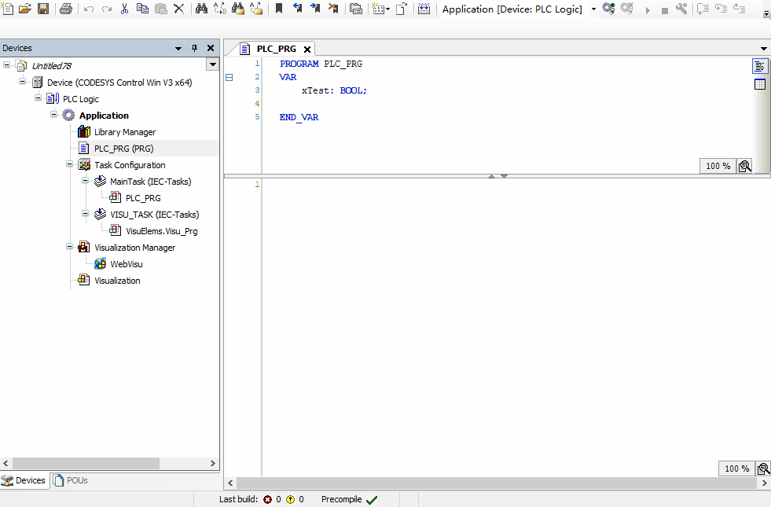
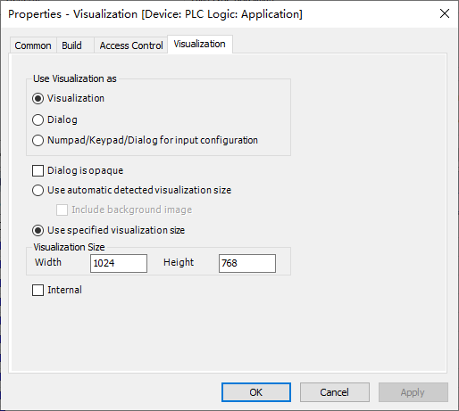

# 4 visu、softmotion、附加功能

## 4.1 Visu结构组成

Visuallization字面意思即可视化，可以理解为内置的组态屏。visu可以直接操作plc变量，比外置组态屏方便很多。最常用的是WebVisu，可以通过浏览器本地访问或局域网内另一台PC远程访问。本地用chromium的kiosk模式打开即和TargetVisu效果一致，且配置更自由。故现在很少会用TargetVisu。

NOTE: **浏览器做visu的设置**
推荐使用 [ungoogled-chromium](https://ungoogled-software.github.io/ungoogled-chromium-binaries/){target=_blank} 作为Chrome的离线、免安装、去更新化方案。创建快捷方式并编辑属性中的目标栏。  
若需要窗口模式，使用`C:\ungoogled-chromium\chrome.exe --app=http://127.0.0.1:8080 --window-size=1040,808`  
若需要全屏模式，使用`C:\ungoogled-chromium\chrome.exe  --kiosk http://127.0.0.1:8080`  


在做visu前，建议各位读者先有一个设计思路。一般情况下，我们推荐元素不要用太多的种类，颜色可以丰富一些并用浅色，字体应用黑体或仿宋，背景可以用浅色纯色或白色90%透明度叠加的背景图片。通常情况下，我们不建议使用官方的指示灯、切换开关、码表等元素，因为图标风格不一致会有设计上的割裂感。按钮、指示灯、文字和框架都可以用矩形来做。Style选择Default或Flat Style。一般不建议在一个界面中挤满元素，而是通过分页、分框架的形式构建界面。下图中，从左至右依次为

- 优秀的设计：颜色搭配协调，有背景图/背景色，有选单折叠，有用户管理，时间显示，特殊按钮有特殊实现，指示灯清晰，但字体有些小。
- 中等的设计：有菜单切换，框架架构，但色彩不协调，对比度过高，字体太细，一个框架内元素过多显得比较乱。
- 不好的设计：颜色较单一且刺眼，按钮分隔不明显，按钮与文本框样式接近无法区分哪些可被点击。

 

----

我们可以在Application下添加Visualization页面，添加第一个visu时会自动添加Visulization Manager。添加visu时会有提示是否勾选VisuSymbols，这是系统内置的一些SVG图片库，可根据需求勾选。默认情况下visu不支持中文，下载后会出现乱码，可在Visualization Manager中勾选Use unicodestrings即可。

 

添加的Visu默认是一个Visualization，可以理解为一个页面。如果需要做对话框可以改变visu属性为dialog。在属性中也可以设置visu的页面大小，该大小为画布大小，建议使用特定值而不是默认的自动检测。实际显示画布还会在visu管理器里根据缩放选项缩放。

 

visu编辑界面右侧会有Visualization Toolbox（没有的话可以在View中选出来），将元素拖放到画布上即可添加。用的最多的是Basic中的矩形、图片和框架。在制作背景、图片按钮或选框时，我们还要在项目中插入ImagePool和TextPool，它们用于给图片或文本分配ID，即可在Visu中静态或动态引用。
	
## 4.2 基础元素

矩形：矩形（或圆角矩形）是最常用的元素，它们既可以作为指示灯，又可以作为按钮，还可以显示文字、信息，亦可以作为分隔线和下拉菜单选框使用。

当作为双色切换的指示灯时，编辑Colors下的Normal state和Alarm state下的Fill color，建议一个改为LightGray，另一个改为LightGreen。并将Apperance下的Line style改为Invisible（或Hollow）。再在Color variables的Toggle color关联变量即可。之后所有的指示灯都可以复制这个元素，只修改关联的变量。



当作为按钮时，可将边框改大以与文本区分，在Texts中输入文字作为按钮标识，并在Input configuration中关联动作。默认指示状态关联Tap/Toggle，可在Color variables的Toggle color中取消关联。一般来说，特殊按钮使用矩形或图片来做，标准按钮使用Button来做。


当作为数值显示时，根据文本内容可以用%s（文字）、%d（整数）、%.2f（小数）并在Text variable中关联变量，即可作为变量显示框。此外，还可以关联Text list并使用Dynamic texts制作中文动态指示。关于文本占位符可以参考 [Placeholders with Format Definition in the Output Text](https://help.codesys.com/webapp/_visu_placeholder_with_formatting_sequence_in_a_string;product=core_visualization){target=_blank} 。

当作为数值输入时，先创建一个数值显示，再在OnMouseClick中添加Write Variable即可，程序中可对输入内容二次校验及限制。

除了矩形外，常用的还有Button（按钮），Image（图片），Frame（框架），Group Box（组合框），Slider（滑动按钮），Line（分割线）等。

TIP: **背景图片**
背景图片可以在visu空白处右键-Background中选择，这样选出来的背景图片不可以被鼠标选中，避免误操作。在用图片做背景时，建议图片尺寸和visu尺寸一致以避免缩放。


## 4.3 界面框架

我们可以用多个相同尺寸visu切换的方式来架构应用，这适用于较少的页面。添加按钮后，在OnMouseClick中选择Change Shown Visualization即可。


在制作十多个页面以上的visu时，按钮切换的方式就会显得复杂了，这时候我们可以用框架（Frame）甚至是多个框架组合来做复杂的界面。作为frame时，一般建议预先规划frame尺寸，并在各个frame的属性中使用特定尺寸的画布大小。需要切换Frame时，我们可以创建一个变量关联到Switch frame variable中，然后就可以在程序里控制展示的Frame。具体到按钮上，可以选Execute ST-Code，然后将变量增加、减小或设置固定值即可。

 

## 4.4 运动控制简介

运动控制（SoftMotion）是CODESYS的一大特色，SoftMotion通过库中的功能块计算每个周期轴应当处在的位置，并通过总线发送给驱动器以达到实时控制的目的，驱动器工作在同步位置模式（CSP）下。除了标准的SoftMotion外，CODESYS还支持SoftMotion Light，发送非实时的指令控制，驱动器工作在PP、PV等模式下。SoftMotion Light还可以通过OpenSML库或自己写逻辑实现，不需要授权，故实际应用较少。

运动控制的授权会在各个授权中标明是否含有，例如树莓派的标准授权中不含运动控制，若需要使用轴或轴组功能则需要额外购买授权，但其可以通过自定义轴结构体并手动映射变量规避，需要一定的编程能力。详细请看[这里](#axis-ref)。 

通常情况下，我们谈论的SoftMotion都是控制EtherCAT总线伺服。也有少量伺服跑在CanOpen模式，它们的通信模式是一致的，操作类似。我们先添加一个EtherCAT_Master_SoftMotion总线设备，在其下添加 SGD7S-xxxxA0x EtherCAT(CoE) SERVOPACK Rev8.06_SM（安川EtherCAT总线伺服），即自动加上了一个轴对象。此外，还有一部分驱动器设备名后不带_SM的不会自动加轴对象，要手动在设备上右键-添加SoftMotion CiA402 Axis，例如汇川SV630N伺服。但一般来说，自动加轴和手动加轴使用上是一致的。


TIP: **Online Config模式**
Online Config模式适用于教学或轴的试运行，只需要添加完设备，物理接线连接好即可。通过点击  按钮，会自动编译一套带有基础运动控制功能和VISU的程序下载并运行。完成后，轴对象中的Commissioning页可用于手动上使能、移动等基础操作，可用于调试和诊断。


调试好基础运动后，我们就可以在程序中创建MC_Power、MC_MoveAbsolute等功能块的实例，并将程序放在EtherCAT Task任务下，即可控制轴的运动。

TIP: **输入助手**
在空白处右键-输入助手（Input Assistant）中的实例调用（Instance Calls）选择需要插入的功能块实例，即可自动插入所有功能块的输入输出变量。

## 4.5 轴、凸轮与插补

在上一小节中我们插入了 *SM_Drive_ETC_Yaskawa_SGD_Sigma7_1* 这个轴对象，我们可以对这个轴做上电、运动控制，运动控制主要分为以下三大类：

1. PTP控制：使用MC_MoveAbsolute、MC_MoveVelocity等功能块直接控制轴运动，例如旋转工作台、传送带等。
2. 凸轮控制：使用MC_CamIn参考CAM表控制，使用MC_GearIn进行按比例的耦合传动控制，适用于凸轮、挺杆、物料传动等。
3. 插补控制：使用SM3_CNC库中的功能块，读取NC文件并按照G代码运行，可用于简单的双、三、四轴插补数控系统，需要CNC授权。

插入轴对象后，可以在轴的Scaling/Mapping页设置速比，常用的设置是16#1000000（16777216脉冲/转）和16#40000（262144脉冲/转），这里的脉冲都经过驱动器换算，有的驱动器反馈实际编码器值，即对应24位编码器和18位编码器。有的驱动器还会除以一个常数比如除以16（16#10）变为16#100000（1048576脉冲/转），一般来说使用24位编码器都会除以16。设置好脉冲和电机转一圈的关系后，我们就可以根据电机转一圈实际移动的距离（由丝杆螺距或齿轮分度圆半径计算得出）来填具体的减速比。填完之后，轴对象的fSetPosition、fActualPosition等参数就是实际的位置，一般以毫米为单位。

TIP: **圆形无限回转的设置**
General页中可以选择轴的模式是旋转（Modulo）或线性（Finite），这部分翻译容易造成误解。当轴驱动的对象为旋转工作台或传送带时，我们一般仍然选择运动模式为线性，这样不会有最短路径的问题。一般来说，只有使用凸轮时会将轴的运动模式设为旋转。

### 4.5.1 PTP控制

在使用PTP控制之前，我先简单介绍一下控制轴运动的两种基本方式（CiA402标准）。

1. 驱动器使用PP（Profile Position）、PV（Profile Velocity）等模式为驱动器控制，EtherCAT总线不需要实时性，只要能把报文发到即可。驱动器的Modes of Operation为1或3，具体的位置控制在驱动器内实现，速度曲线一般为梯形斜坡加驱动器内置的Smooth平滑功能。

2. 驱动器使用CSP（Cyclic synchronous position mode），EtherCAT总线需要保证实时性，驱动器的Modes of Operation为8，位置控制主体在PLC内实现，速度曲线在CODESYS的轴对象上选择，一般为Trapezoid（一次斜坡，或称梯形）、SIN<sup>2</sup>（Sin2曲线，是S曲线的一种，不需要设定加加速度） 、Quadratic（二次曲线，标准S曲线，需要设定加加速度）三种。由于Sin2曲线或更高阶的速度曲线打断后可能会有加加速度的突变，一般用的最多的为梯形和二次。对于运动控制来说，阶数越高运动越平稳，但有个极限值，大多数运动到2次以上意义就不大了，因为驱动器控制还是会带来位置差异。实际应用中最常规的为2次曲线，最高的的为6次曲线。

我们常说的SoftMotion是用CSP模式，位置在PLC内计算并按照实时周期发送给驱动器。一般情况下，驱动器的位置反馈只用于判断跟随误差，不会带入到位置的计算中。即使是用MC_MoveVelocity控制速度的模式，实际发送给驱动器的还是下个周期的目标位置。

一个简化的位置控制代码如下，给定fTargetPosition，再给xExecute即可开始运动。对于频繁变更位置的场景，可以将xExecute不停取反：

```iecst
VAR
	mcp:MC_POWER;
	mcm:MC_MoveAbsolute;
	mcs:MC_Stop;
	xExecute: BOOL;
	fTargetPosition: LREAL;
	rSpeed: LREAL:=30;
	rAcc: LREAL:=20;
	rJerk: LREAL:=100;
	biEmergencyStop:BOOL:=TRUE;
END_VAR

mcp(Axis:=AxisT,Enable:=TRUE,bRegulatorOn:=TRUE,bDriveStart:=TRUE);
mcm(Axis:=AxisT,Execute:=xExecute,Position:=fTargetPosition,Velocity:=rSpeed,Acceleration:=rAcc,Deceleration:=rAcc,Jerk:=rJerk);
mcs(Axis:=AxisT,Execute:=NOT biEmergencyStop AND mcp.Status,Deceleration:=rAcc,Jerk:=rJerk);
```

### 4.5.2 凸轮控制

电子凸轮由一个虚拟主轴从0度到360度按一定速度做匀速运动，从轴按照设定的凸轮位置曲线做重复运动，凸轮曲线（Cam Table）可定义主轴在任意角度时从轴的位置、速度和加速度以达到一个平滑的运动曲线。凸轮曲线不止可用于凸轮，少数情况下也可以用挺杆功能来实现挺杆运动，但一般情况下由程序判断凸轮主轴角度更易实现挺杆功能。此外，还可以将从轴也定义为虚轴，自定义缩放比例，再用SMC_ControlAxisByPos直接控制轴的位置运动。

凸轮控制不同行业有不同的控制方法，此处不再示范代码。在实际程序中，需注意启停和异常时的加耦和解耦操作。

### 4.5.3 插补控制

CODESYS声称支持6轴插补，但大多实际应用只用到2轴、3轴插补，高于3轴需要做TCP程序，复杂度提升很多。这里简单说一下三轴龙门的程序结构。插补运动时，XYZ坐标根据G代码指示运动，选择不同的G代码文件即可做不同的复合运动。一般来说，一个支持插补运动的PLC由以下部分组成：

1. 文件选择和展示（PRG_FileProvider）
2. 路径预规划（CNC_PreparePath）
3. 路径执行（CNC）
4. M代码（PRG_MFunction）
5. 主程序（PRG_Main）

其中，核心代码在路径预规划和路径执行中。当加载完程序并启动后，路径预规划模块开始执行。通过SMC_ReadNCFile读取文件，从ncprog输出可获取到原始程序的文字内容。紧接着，我们通过SMC_NCDecoder功能块对ncprog进行解码，获得poqDataOut输出，这是一个指向SMC_OUTQUEUE的指针，之后的数据处理都围绕poqDataOut来做，相当于一段数据从poqDataIn经过功能块实例流向poqDataOut。

之后，我们需要对路径进行粘合，否则每执行一行代码所有轴都会完整启停。通过SMC_SmoothPath功能块对SMC_NCDecoder的数据进行处理并写入到自己的poqDataOut中。最后，通过SMC_CheckVelocities检查路径中无法拟合的急转弯，将这些转弯部分的速度降至0。路径预处理即完成。

路径预处理和路径执行是可以同时做的，对于上千行的G代码文件，只要有一部分预处理完成的数据即可边处理边执行。在CNC程序中，我们首先使用MC_Power功能块对X、Y、Ys、Z各轴进行上电、复位等操作，当各轴状态均正常后，通过SMC_Interpolator插补器对poqPath进行插补，得到一组数据输出，该输出为实时的各轴预期位置。之后，通过SMC_TRAFO_Gantry3将各轴数据分解为X、Y、Z三个方向，再用SMC_ControlAxisByPos对各轴进行控制。

具体的G代码相关解释可以参考 [DIN 66025 Fundamentals](https://help.codesys.com/webapp/_sm_cnc_din66025_basics;product=codesys_softmotion;version=4.6.0.0){target=_blank} 


## 4.6 配方和报警

配方（Recipe Manager）常用于存储多组可变参数表，相当于自定义一个结构体存在保持变量表里。但与保持变量不同的是，配方可以由程序控制加载、保存，并可以保存成多个文件，可以随意加载并修改。多用于参数较多且易变的设备中。一个项目中只能有一个配方管理器，但可以有多个配方。配方中的变量必须已在程序中被定义，一般会定义一个结构体并在保持变量中声明。

报警（Alarm Configuration）是大多数项目用不到的功能。在一些中大型或有记录需求的项目中很有用。通常勾选Archiving，并创建AlarmGroup后，可在AlarmStorage中定义保存路径，报警将会自动保存成SQLite文件，可用DB Browser for SQLite打开查看，但更常用的是直接登陆上设备，并在AlarmStorage上右键-CSV Export of Alarm Storage，后者会自动转换时间格式并添加Message信息。

Data Sources Manager可用于多个PLC的报警归纳，但一般较少使用。我们更推荐使用NVL（Network Variable List）实现变量的传递，可控周期和更好的扩展性。

## 4.7 全局变量、保持变量和网络变量

TIP: **编译修饰符**
创建任意变量表时默认添加`{attribute 'qualified_only'}`修饰，该修饰会导致引用变量时要带着变量表名称，例如 **GVL.iTest** 或 **PersistentVars.iTest2** 。可根据需求移除，移除后不需要带变量表名称即可引用。

POU中VAR和END_VAR之间定义的变量为局部变量，可以在POU中读写，外部只可以读取不可以写入。如有少量写入需求，可以定义在VAR_INPUT、VAR_IN_OUT下。多数时候公共变量我们会创建一个全局变量表GVL（Global Variable List），可以从任意POU、FB中读写访问。

通过创建保持变量表（Persistent Variables），变量可以在每次关机时自动保存，并在下次开机时自动加载。CODESYS仅支持一个保持变量表，您也可以在POU里定义VAR PERSISTENT（注意这里两个单词间没有下划线），也可以自动保持变量。但该方式最终编译仍然是链接到PersistentVars中，故一般推荐只在PersistentVars中定义保持变量。

保持变量还可以通过顶层模块（View-Module打开模块列表，添加库选择AC_Persistence，添加顶层模块PersistenceManager）来自定义保存路径、保存时间和保持变量的转入转出。但由于复杂度太高，一般采用配方Recipe或自己写CSV文件读写替代。

网络变量NVL（Network Variable List）适用于一个网段下两台或多台设备的通讯，由CODESYS实现底层协议，我们定义一个发送者和一个接收者即可。如果需要双向通讯，则需要在两个设备下各自创建发送和接收，多设备可以组环网。一般来说，我们会在一个项目中创建多个设备，并在POU页定义公共结构体，再在网络变量中引用结构体，即可实现环网、自适应的网络变量。相对于Modbus TCP或其他基于TCP的总线来说，网络变量可以近乎无限制的创建任意变量表，没有大小端和地址问题，比较方便。


## 4.8 日期、大小端、特殊功能

### 日期

Codesys默认是从系统读取时间，系统依赖于RTC时钟。由于各厂家RTC时钟设置有差异，我们不去讨论设置时间，而是看看如何读取时间。需要在库管理器中添加`SysTime`和`SysTypes2 Interfaces`库。
```iecst
VAR
	udiUtcTime:UDINT;
	Result:RTS_IEC_RESULT;
	udiUtcTimeLocal:UDINT;
	dtDateAndTime:DT;
	sDateAndTime:STRING;
	
	sDate:STRING;
	sTime:STRING;
END_VAR

udiUtcTime := SysTimeRtcGet(Result);//获取时间
Result := SysTimeRtcConvertUtcToLocal(udiUtcTime, udiUtcTimeLocal);//转换为UTC时间
dtDateAndTime := UDINT_TO_DT(udiUtcTimeLocal);//将时间从udint转换为DT
sDateAndTime := DT_TO_STRING(dtDateAndTime);//将时间从DT转换为STRING，将自动补0

sDate := MID(sDateAndTime , 10 , 4);//获取当前日期，格式2001-01-01
sTime := RIGHT(sDateAndTime , 8);//获取当前时间，格式00:00:00
```

----

### 大小端

在和西门子或Modbus设备通讯时容易遇到大小端问题，一个32位的数据会拆分成4个byte，如果发送方是ABCD，则接收端可能是CDAB，这就是大小端问题。
大小端有很多种解法，例如创建数组关联每一位、创建联合体等，在这里我提出一个较简单的写法：
```iecst
FUNCTION FUN_EC : DWORD
VAR_INPUT
	dwInput:DWORD;
END_VAR

FUN_EC:=SHL(dwInput,16) OR SHR(dwInput,16);
```
该方法只适用于DWORD，如果您使用的变量是DINT或REAL，则外部还需要转换，例如：
```iecst
aa := DWORD_TO_DINT(FUN_EC(bb));
cc := FUN_EC(DINT_TO_DWORD(dd));
```

----

### 关机

所有的带系统的PLC，如Linux、WES7、WIN10系统，都需要正常的关机流程或配备UPS模块。不带系统的或经过OEM厂商特殊优化的Linux除外。如果没有优化过系统断电，则需要手动关机。为了不破坏用户体验，一般会在界面上写一个按钮或关联UPS的输出变量来自动关机。
	

- Windows系统（ControlWin和ControlRTE一致）：在库管理器中添加`SysProcess`和`SysTypes2 Interfaces`库，在程序中使用：

```iecst
VAR
    xShutdown: BOOL;
    Result: RTS_IEC_RESULT;
END_VAR

IF xShutdown THEN
    SysProcess.SysProcessExecuteCommand('shutdown -s -t 0', ADR(Result));
    xShutdown := FALSE;
END_IF
```

- Linux系统：编辑配置文件，在`[SysProcess]`下改为**Command=AllowAll**，在库管理器中添加`SysProcess`和`SysTypes2 Interfaces`库，在程序中：
	
```iecst
VAR
    xShutdown: BOOL;
    Result: RTS_IEC_RESULT;
END_VAR

IF xShutdown THEN
	SysProcess.SysProcessExecuteCommand('sudo shutdown now', ADR(Result));
    xShutdown := FALSE;
END_IF
```

----

### 获取序列号

如果系统对客户开放，则第三方也可以拷出来编译后的二进制文件运行（但不可修改）。若有加强保密的需要，可添加序列号校验。该方式不是绝对的安全，编译后的二进制文件只有CRC校验，没有混淆加密，相对于运行时更易被破解。在库管理器中添加`SysTarget`和`SysTypes2 Interfaces`库，在程序中：

```iecst
VAR
    Result: RTS_IEC_RESULT;
	psSN: POINTER TO STRING(255);
	sSN : STRING(255);
	maxLen: DINT := 255;
END_VAR

IF psSN = 0 THEN
	Result := SysTarget.SysTargetGetSerialNumber(ADR(psSN),ADR(maxLen));
END_IF
sSN := psSN^;
```

----

### 处理变量越界

单圈绝对值编码器转一圈读数会回零，在驱动中会用已记录的圈数乘以一圈脉冲量再加上当前脉冲量来获取位置。变量也是类似，一个32位的变量会越界，越界结果是回零或正/负极限。根据突变规律可以将32位扩展到64位，就不会越界了。同样的道理也可以应用在16位扩展32位上。

```iecst
FUNCTION_BLOCK FB_PosCalc
VAR_INPUT
	In:DINT;
	xReset:BOOL;
END_VAR
VAR_OUTPUT
	Out:LINT;
END_VAR
VAR
	udiTemp:UDINT;
	byTemp:byte;
	byTempOld: BYTE;
	diTemp:DINT;
	udiOffset: UDINT;
END_VAR

//越界后正负不好判断，转为UDINT后判断越界
udiTemp:=DINT_TO_UDINT(In);

//正向越界（11xxx=>00xxx），当前值00，旧值11。反向越界（00xxx=>11xxx）,当前值11，旧值00。
byTemp.0:=udiTemp.30;
byTemp.1:=udiTemp.31;
IF byTemp = 0 AND byTempOld = 3 THEN
	diTemp:=diTemp+1;
ELSIF byTemp = 3 AND byTempOld = 0 THEN
	diTemp:=diTemp-1;
END_IF
byTempOld:=byTemp;

//高位移位，正负依然有效（最高位）。低位借用当前值减偏置值
Out:=diTemp;
Out:=ROL(Out,32);
Out:=Out+udiTemp-udiOffset;

IF xReset THEN
	udiOffset:=udiTemp;
	diTemp:=0;
END_IF
```
----

### 自定义AXIS REF规避授权

SoftMotion包含很多内容，主要有MC_xxx功能块用来控制轴；轴设备用来修改减速比，限位等参数；visu用来online config以及通用的界面展示。SoftMotion的授权是基于轴这个设备的，即授权检测在设备上而不是在功能块中。这样，我们可以创建一个变量，类型为AXIS_REF_SM3，对于库中的程序来说是一个实轴对象。要让这个对象使能并正常运行，我们需要做一些操作，如下程序。

```iecst
VAR
	Axis1:AXIS_REF_SM3;
END_VAR

Axis1.bCommunication:=TRUE;
Axis1.bRegulatorOn:=TRUE;
Axis1.bDriveStart:=TRUE;
Axis1.bRegulatorRealState:=TRUE;
Axis1.bDriveStartRealState:=TRUE;
IF Axis1.nAxisState=0 THEN
	Axis1.nAxisState:=3;
END_IF
Axis1.eRampType:=2;//速度曲线类型
Axis1.fSavePosition:=Axis1.fSetPosition;
Axis1.fCycleTimeSpent:=0;
Axis1.fTaskCycle:=0.001;//任务周期
```

之后，我们就可以用MC_MoveAbsolute等功能块的实例控制轴运动，此时相当于是创建了一个不需授权的虚轴。虚轴要和实轴连起来还需要做一些补丁，可以参考OpenSML，对驱动器上使能并工作在CSP模式，初始化位置等操作。需要注意的是，和标准的实轴对比，有以下几个缺点：

1. 无法设定减速比，需要自己换算并应用到TargetPosition上。
2. 需要自己写报警，没有位置反馈时检测不到跟随误差。
3. 特殊操作如回参、力矩模式可能会有问题。

----

### 共享内存

共享内存 (Shared memory architecture)可以在**本机**，注意必须是同一CPU上，可以共享一段或多段内存地址，一般由PLC共享两段，一段只读，一段只写。C#或C++应用去访问，速度极快，瓶颈可以覆盖CODESYS的扫描周期，常用于外置算法处理。Shared Memory可以参考 [CODESYS官方示例](https://forge.codesys.com/prj/codesys-example/shared-memory-c/home/Home/){target=_blank} 。这里给出一个官方没有的树莓派（Linux）下C++的应用，若使用Geany，编译指令`g++ -Wall -o "%e" "%f" -lrt`；若使用Qt Creator，pro文件中`LIBS += -lrt`。请注意要用管理员权限运行Geany/QtCreator，否则报Segmentation fault。
```cpp
#include <stdio.h>
#include <stdlib.h>
#include <sys/mman.h>
#include <sys/stat.h>
#include <fcntl.h>
#include <string.h>
#include <unistd.h>

struct DataExchange {
    int i1;
    int i2;
};

int main()
{
    struct DataExchange *pRead, *pWrite;
    char sSharedMemReadName[100] = "_CODESYS_SharedMemoryTest_Write"; 
    char sSharedMemWriteName[100] = "_CODESYS_SharedMemoryTest_Read";

    int fdRead = shm_open(sSharedMemReadName, O_CREAT | O_RDWR, S_IRWXU | S_IRWXG);
    printf("Shared Memory Read: %s %d\n\n",sSharedMemReadName, fdRead);
    ftruncate(fdRead, sizeof(*pRead));
    pRead = (DataExchange*)mmap(0, sizeof(*pRead), PROT_READ | PROT_WRITE, MAP_SHARED, fdRead, 0);
    close(fdRead);

    int fdWrite = shm_open(sSharedMemWriteName, O_CREAT | O_RDWR, S_IRWXU | S_IRWXG);
    printf("Shared Memory Write: %s %d\n\n",sSharedMemWriteName, fdWrite);
    ftruncate(fdWrite, sizeof(*pWrite));
    pWrite = (DataExchange*)mmap(0, sizeof(*pWrite), PROT_READ | PROT_WRITE, MAP_SHARED, fdWrite, 0);
    close(fdWrite);

    do
    {
        sleep(1);
        printf("pRead->i1: %d pRead->i2: %d pWrite->i1: %d pWrite->i2: %d\n", 
               pRead->i1, pRead->i2, pWrite->i1, pWrite->i2);
        printf("Press 'Enter' to increment values or 'q' and then 'Enter' to quit\n");    
        pWrite->i1++;
        pWrite->i2--;     
    } while (getchar() != 'q');

    munmap(pRead, sizeof(*pRead));
    shm_unlink(sSharedMemReadName);

    munmap(pWrite, sizeof(*pWrite));
    shm_unlink(sSharedMemWriteName); 
    exit(0);
}
```

----


