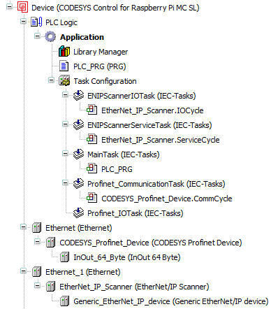

# 6 实战技巧

## 6.1 代码规范

1. 变量命名带前缀以识别变量格式，例如`rTarPos:REAL;`，`biEmergencyStop:BOOL;`等，可参阅 [CoDeSys Identifiers](https://help.codesys.com/webapp/_cds_identifiers;product=codesys){target=_blank} 。
2. 较多或多设备共用的变量归纳为结构体。例如`hb: ST_HANDBOX`，`cy: ST_CYLINDER`等。
3. 尽量使用标准的语法，例如`IF..THEN..ELSIF..END_IF`，`CASE..OF..END_CASE`等。避免使用ExST，不方便移植。
4. 需要映射到IO的变量直接在对应IO设备内关联，尽量不使用`AT %IX0.0`的直接地址引用。批量数据除外。
5. 重复变量、功能块和结构体使用`arTest: ARRAY[0..2] of ST_TEST`之类的一维到三维数组，一般不建议超过二维。
6. 大多数程序中都使用CASE进行分步，并做好注释。尽量避免WHILE循环。FOR循环中也需要检测最大值。
7. 善用交叉引用和全局搜索功能。这方面还是TIA好，除了交叉引用还可以用#REGION带注释定位。而CODESYS的region pragma还不如缩进。
8. 创建文件夹归纳Visu、POU、Struct和GVL等。
9. 较长的判断逻辑可以分行，并在每一行做好注释。变量名不宜过长，变量深度一般不超过3层。

## 6.2 CASE分步

CASE是ST的基础语法，很多老师傅从梯形图转到ST编程后不会灵活运用CASE分步，这里单独拎出来做一小节。在实际应用中，十个程序有八个都会用CASE分步以清晰流程。例如，一个传送带设备，主体结构如下：传送带运行 -> 传感器1检测到物体，传送带停止 -> 气缸1动作，500MS后松开 -> 等待传感器2 -> 传送带运行。

```iecst
CASE iState OF
    0:
        Out.Trans:=TRUE;//传送带运行
        IF In.Sensor1 THEN//检测到Sensor1，跳转到第10步
			Out.Trans:=FALSE;
            iState:=10;
        END_IF
    10:
        Out.Cylinder:=TRUE;//气缸打开
        ton_Delay(IN:=TRUE,PT:=T#500MS);//计时器500MS
        IF ton_Delay.Q THEN
            ton_Delay(IN:=FALSE);//复位计时器
            Out.Cylinder:=FALSE;//关闭气缸
            iState:=20;//跳转到第20步
        END_IF
    20:
        IF In.Sensor2 THEN//检测到Sensor2，跳转到0步
            iState:=0;
        END_IF
END_CASE
```

CASE分步时用的iState一般选INT，每个步骤一般间隔10以方便后期增减步骤，报警时做一个特殊步骤例如999。有些自动化流程中会有暂停再继续的需求，可在暂停时根据iState的值判断能否继续，对iState加1或减1操作一次让流程卡住，需要继续时恢复iState的值即可从中断步骤继续运行。

当使用Visu时，iState还可以用作当前步骤显示。添加一个TextList，将ID与iState关联并用作文本框的Dynamic text index即可。

## 6.3 基础的visu、softmotion项目

 

该项使用了两个安川伺服轴，用MC_MoveAbsolute做基础的运动控制。使用了ImagePool嵌入背景图片和LOGO，使用PersistentVars保存参数配置。

## 6.4 三轴龙门CNC

 

该项目使用四个伺服轴搭建龙门结构的CNC，使用Visu进行加载文件、手动和执行程序的操作，并在本地通过浏览器显示。代码主体结构参考官方示例 `C:\Program Files\CODESYS 3.5.17.30\CODESYS\Projects\SoftMotion\4.10.0.0\Examples\Tutorial\`。

## 6.5 多总线网关

 

该项目将PLC作为ProfiNet从站，由S7-1200连接过来。同时作为EtherNET/IP主站，将数据桥接。

## 6.6 常见问题答疑

冗余：CODESYS支持冗余，但在冗余框架内的两台设备都需要独立的冗余授权。且EtherCAT冗余需要额外的EtherCAT专用交换机，不支持ProfiNET冗余。理论上来说EtherCAT冗余也无法做到dc不中断，可能会造成轴抖动等问题。

矩阵：矩阵功能需要单独收费。可以考虑用python、c++应用计算矩阵，再通过shm或tcp与codesys通讯。

符号通讯：符号通讯类似tia的s7协议，但相对封闭，仅对部分厂商开放。

OPC UA：标准授权内包含opc ua服务器，可以访问数据。但opc ua底层不开放，商用需授权，限制了其适用范围。

代码自动格式化：付费，由STweep Formatter for CODESYS提供。（很难想象2023年了代码格式化还需要第三方插件实现）