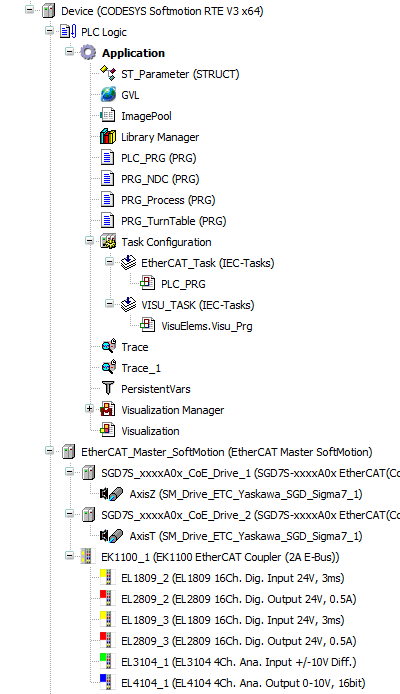
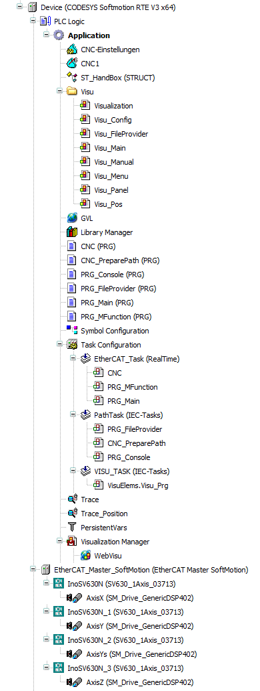

# 6 实战技巧

## 6.1 基础的visu、softmotion项目

 

该项目较为简单，使用了两个安川伺服轴，均使用MC_MoveAbsolute基础运动控制。使用了ImagePool嵌入背景图片和LOGO，使用PersistentVars保存参数配置。

## 6.2 三轴龙门CNC

 

## 6.3 多总线网关

## 6.4 TCP通讯和文件操作

## 6.5 常见问题答疑

冗余：CODESYS支持冗余，但在冗余框架内的两台设备都需要独立的冗余授权。且EtherCAT冗余需要额外的EtherCAT专用交换机，不支持ProfiNET冗余。理论上来说EtherCAT冗余也无法做到dc不中断，可能会造成轴抖动等问题。

矩阵：矩阵功能需要单独收费。可以考虑用python、c++应用计算矩阵，再通过shm或tcp与codesys通讯。

符号通讯：符号通讯类似tia的s7协议，但相对封闭，仅对部分厂商开放。

OPC UA：标准授权内包含opc ua服务器，可以访问数据。但opc ua底层不开放，商用需授权，限制了其适用范围。

代码自动格式化：付费，由STweep Formatter for CODESYS提供。（很难想象2023年了代码格式化还需要第三方插件实现）